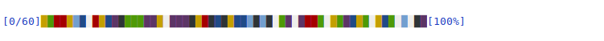

# Progressons

Display a progress bar on one line.

    [1437/1437]██████████████████████████████████████████████████████████████████████████[100%]

- [X] Support for real and dumb terminal windows
  - on the terminal, it correctly updates the progress percent and the number of items. On a dumb terminal like Emacs Slime, it can't erase the previous step to update the numbers, so it simply prints one progress indicator after the other, still on one line.

Status: usable for simple cases, work in progress, the API might change.

## Usage

Instantiate with `(progressbar data)` and call `(step!)` at each iteration.

~~~lisp
(loop for elt in (progressbar (list 1 2 3 4 5))
   do (do-something-with elt)
      (sleep 0.1)
      (step!))
~~~

`data` is a list of data, or an integer specifying the number of iterations.

Use the bar character you want with `:bar ">"` (a character or a string of one element):

~~~lisp
(loop for line in (progressbar (list 1 2 3 4 5) :bar ">") do (sleep 0.3) (step!))

[0/5]>>>>>>>>>>>>>>>>>>>>>>>>>>>>>>>>>>>>>>>>>>>>>>>>>>>>>>>>>>>>>>>>>>>>>>>>>>>>>>>>[100%]
~~~

Use `(progressbar data :rainbow t)` for some colors:



but… that works only on a dumb terminal, too bad (we don't see the progress on a real terminal).

Run the demo:

    sbcl --load demo.lisp
    # aka make demo

Manual progress:

```
CL-USER> (progressbar (list 1 2 3 4 5))
(1 2 3 4 5)
#<PROGRESS BAR, length 5, step 16>

CL-USER> (step!)
>>>>>>>>>>>>>>>>                                                                [20]

CL-USER>  (step!)
>>>>>>>>>>>>>>>>>>>>>>>>>>>>>>>>                                                [40]
[…]
CL-USER>  (step!)
>>>>>>>>>>>>>>>>>>>>>>>>>>>>>>>>>>>>>>>>>>>>>>>>>>>>>>>>>>>>>>>>>>>>>>>>>>>>>>>>[100]
```

`step!` takes an optional progressbar object as argument.

We'd like to remove the need of calling `(step!)` eventually.


## Do it yourself

The guist of a progress bar is to print a string, then erase it to
print a longer one by printing a backspace character `(write-char #\return)`.

## See also

https://github.com/sirherrbatka/cl-progress-bar (oops, it's probably OK for my use case and more complete)

https://40ants.com/lisp-project-of-the-day/2020/04/0034-cl-progress-bar.html

Licence: MIT
